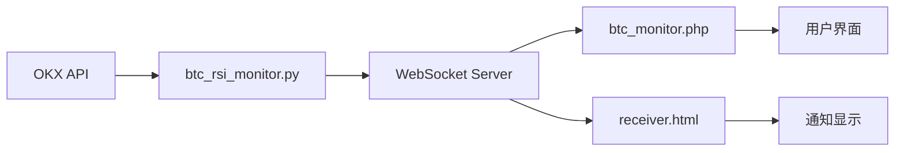

# 凑面 (Coumian) 开发文档 v1.1

## 版本历史

| 版本   | 日期         | 描述                                          | 作者                    |
|--------|--------------|----------------------------------------------|------------------------|
| v1.1   | 2024-12-07  | 添加BTC-RSI监控功能，改进WebSocket通知系统    | 凑面团队 三颗花生 sxh    |
| v1.0   | 2023-12-06  | 首个正式版本发布，基础任务提醒功能            | 凑面团队 三颗花生 sxh    |

## 项目概述

凑面（Coumian）是一个多功能的Web应用系统，整合了任务提醒和加密货币监控功能。系统支持实时通知、声音提醒、BTC-RSI指标监控等特性，采用WebSocket技术实现实时数据推送。

### 主要功能
1. **任务提醒系统**
   - 任务创建和管理
   - 精确到秒的定时提醒
   - 任务状态追踪
   - 声音提醒功能

2. **BTC-RSI监控系统**
   - 多时间周期RSI监控
   - 实时价格更新
   - 超买超卖提醒
   - WebSocket实时通知

## 系统架构

### 1. 目录结构
```
coumian/
├── docs/                # 文档
│   ├── development.md   # 开发文档
│   └── development.pdf  # PDF版文档
├── web/                # Web应用目录
│   ├── app/            # 应用核心代码
│   │   ├── Database.php
│   │   └── Task.php
│   ├── config/         # 配置文件
│   │   └── config.php
│   ├── public/         # 公共访问目录
│   │   ├── add_task.php
│   │   ├── tasks.php
│   │   ├── btc_monitor.php
│   │   └── receiver.html
│   └── websocket_server.php
├── btc_rsi_monitor.py  # BTC监控脚本
└── README.md
```

### 2. 核心组件

#### 2.1 Web界面
- **btc_monitor.php**
  - BTC-RSI监控界面
  - 多时间周期数据显示
  - WebSocket客户端实现
  - 自动更新机制

- **receiver.html**
  - 通知接收器界面
  - 声音控制功能
  - 通知历史记录
  - 连接状态显示

#### 2.2 服务端组件
- **websocket_server.php**
  ```php
  class WebSocketServer implements \Ratchet\MessageComponentInterface {
      protected $clients;
      
      public function __construct() {
          $this->clients = new \SplObjectStorage;
      }
      
      public function onOpen(\Ratchet\ConnectionInterface $conn) {
          $this->clients->attach($conn);
          echo "New connection! ({$conn->resourceId})\n";
      }
      
      public function onMessage(\Ratchet\ConnectionInterface $from, $msg) {
          foreach ($this->clients as $client) {
              $client->send($msg);
          }
      }
  }
  ```

- **btc_rsi_monitor.py**
  ```python
  def calculate_rsi(data, period=14):
      gains = []
      losses = []
      for i in range(1, len(data)):
          change = float(data[i]) - float(data[i-1])
          gains.append(max(change, 0))
          losses.append(abs(min(change, 0)))
      # ... RSI计算逻辑
  ```

### 3. 数据流



## 功能特性

### 1. BTC-RSI监控
- **数据获取**
  ```php
  public function getOKXData($period) {
      $url = "https://www.okx.com/api/v5/market/candles";
      $params = [
          'instId' => 'BTC-USDT',
          'bar' => $period,
          'limit' => 100
      ];
      // ... API调用实现
  }
  ```

- **RSI计算**
  ```php
  public function calculateRSI($data, $period = 14) {
      if (empty($data['data'])) {
          return ['rsi' => 50, 'price' => 0];
      }
      
      $closes = array_map(function($candle) {
          return floatval($candle[4]);
      }, $data['data']);
      
      // RSI计算逻辑
      $gains = [];
      $losses = [];
      
      for ($i = 1; $i < count($closes); $i++) {
          $change = $closes[$i] - $closes[$i - 1];
          $gains[] = max($change, 0);
          $losses[] = abs(min($change, 0));
      }
      
      return ['rsi' => $rsi, 'price' => $latestPrice];
  }
  ```

### 2. WebSocket通知系统

#### 2.1 连接管理
```javascript
function connectWebSocket() {
    ws = new WebSocket('ws://localhost:8081');
    
    ws.onopen = () => {
        console.log('WebSocket已连接');
        wsStatus.textContent = '已连接';
        wsStatus.className = 'text-green-500';
        reconnectAttempts = 0;
        showToast('WebSocket连接成功', 'success');
    };
    
    ws.onclose = () => {
        console.log('WebSocket连接已断开');
        wsStatus.textContent = '已断开';
        wsStatus.className = 'text-red-500';
        
        if (reconnectAttempts >= maxReconnectAttempts) {
            wsStatus.textContent = '连接失败，请刷新页面重试';
            showToast('WebSocket连接失败，已达到最大重试次数', 'error');
            return;
        }
        
        reconnectAttempts++;
        const delay = Math.min(3000 * Math.pow(1.5, reconnectAttempts - 1), 10000);
        setTimeout(connectWebSocket, delay);
    };
}
```

#### 2.2 通知格式
```json
{
    "type": "btc_rsi",
    "title": "BTC-RSI 提醒",
    "content": "RSI(1H) = 75.3 - 超买区域",
    "timestamp": "2024-12-07 12:00:00"
}
```

### 3. 用户界面

#### 3.1 状态显示
```html
<div class="flex items-center justify-between mb-8">
    <h1 class="text-3xl font-bold text-gray-800">BTC-RSI监控</h1>
    <div class="flex items-center space-x-2">
        <div id="connection_status" class="w-3 h-3 rounded-full bg-gray-400"></div>
        <span id="status_text" class="text-gray-600">等待连接...</span>
    </div>
</div>
```

#### 3.2 Toast通知
```javascript
function showToast(message, type = 'info') {
    const toast = document.createElement('div');
    toast.className = `fixed bottom-4 right-4 px-6 py-3 rounded-lg text-white fade-in ${
        type === 'success' ? 'bg-green-500' :
        type === 'error' ? 'bg-red-500' :
        type === 'warning' ? 'bg-yellow-500' :
        'bg-blue-500'
    }`;
    toast.textContent = message;
    document.body.appendChild(toast);
    
    setTimeout(() => {
        toast.style.opacity = '0';
        setTimeout(() => toast.remove(), 500);
    }, 3000);
}
```

## 部署说明

### 1. 环境要求
- PHP 7.4+
- Python 3.8+
- MySQL 5.7+（任务系统）
- Composer
- 必要的PHP扩展：
  - WebSocket
  - curl
  - json
  - pdo_mysql

### 2. 安装步骤

#### 2.1 基础设置
```bash
# 克隆项目
git clone [项目地址]
cd coumian

# 安装PHP依赖
cd web
composer install

# 安装Python依赖
pip install requests websocket-client
```

#### 2.2 数据库设置
```sql
CREATE DATABASE coumian;
USE coumian;

CREATE TABLE tasks (
    id INT AUTO_INCREMENT PRIMARY KEY,
    title VARCHAR(255) NOT NULL,
    description TEXT,
    notification_time DATETIME NOT NULL,
    status ENUM('pending', 'completed') DEFAULT 'pending',
    created_at TIMESTAMP DEFAULT CURRENT_TIMESTAMP
);
```

#### 2.3 启动服务
```bash
# 启动PHP开发服务器
cd web/public
php -S localhost:8000

# 启动WebSocket服务器
cd web
php websocket_server.php

# 启动BTC监控脚本
python btc_rsi_monitor.py
```

## 错误处理

### 1. API错误
```javascript
try {
    const response = await axios.get(`btc_monitor.php?action=update&t=${Date.now()}`);
    if (!response.data || !response.data.success) {
        throw new Error(response.data?.error || '更新失败');
    }
} catch (error) {
    console.error('更新失败:', error);
    showToast('数据更新失败', 'error');
}
```

### 2. WebSocket错误
```javascript
ws.onerror = (error) => {
    console.error('WebSocket错误:', error);
    wsStatus.textContent = 'WebSocket错误，等待重新连接...';
    wsStatus.className = 'text-red-500';
    showToast('WebSocket连接错误', 'error');
};
```

## 监控指标

### 1. RSI阈值设置
```php
const RSI_OVERBOUGHT = 70;
const RSI_OVERSOLD = 30;

if ($rsi >= RSI_OVERBOUGHT) {
    $trend = '超买';
    $notification = true;
} elseif ($rsi <= RSI_OVERSOLD) {
    $trend = '超卖';
    $notification = true;
}
```

### 2. 时间周期
```php
protected $periods = [
    '1m'  => '1分钟',
    '15m' => '15分钟',
    '30m' => '30分钟',
    '1H'  => '1小时'
];
```

## 安全考虑

### 1. 数据安全
- 使用PDO预处理语句防止SQL注入
- API响应数据验证
- WebSocket消息格式验证

### 2. 错误处理
```php
try {
    $data = $this->getOKXData($period);
    if (empty($data['data'])) {
        throw new Exception('获取数据失败');
    }
} catch (Exception $e) {
    error_log("Error: " . $e->getMessage());
    return ['success' => false, 'error' => $e->getMessage()];
}
```

## 后续计划

### 1. 功能增强
- 支持更多交易对（ETH、DOT等）
- 添加更多技术指标（MA、MACD等）
- 自定义告警规则

### 2. 性能优化
- 实现数据缓存
- WebSocket连接池
- 前端性能优化

### 3. 用户体验
- 深色模式支持
- 移动端适配优化
- 多语言支持

## 维护说明

### 1. 日志记录
```php
error_log("WebSocket connection established: {$conn->resourceId}");
error_log("API Response: " . json_encode($response));
error_log("Error occurred: " . $e->getMessage());
```

### 2. 性能监控
- API响应时间监控
- WebSocket连接状态监控
- 内存使用监控

## 开发规范

### 1. 代码风格
- 遵循PSR-4自动加载规范
- 使用ESLint进行JavaScript代码检查
- Python代码遵循PEP 8规范

### 2. 注释规范
```php
/**
 * 计算RSI指标
 * @param array $data K线数据
 * @param int $period RSI周期
 * @return array ['rsi' => float, 'price' => float]
 */
public function calculateRSI($data, $period = 14) {
    // 实现代码
}
```

## 许可证
MIT License

## 联系方式
- 项目维护团队：凑面团队
- 主要开发者：三颗花生 (sxh)
- 项目仓库：[GitHub地址]
